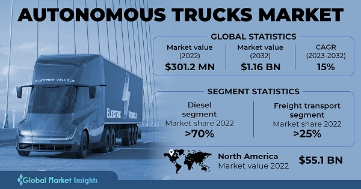

**"AI-first" driving simulator will have
the edge**

> Waabi World -- a unique approach to autonomous trucking

1.  INTRODUCTION

> Waabi was founded in 2021 by Raquel Urtasun bringing a 20 year career
> in AI and 10 years of experience building self-driving solutions to
> build on the vision of an autonomous vehicle. ([Team --
> Waabi](https://waabi.ai/team/))
>
> The idea for Waabi emerged from Urtasun\'s extensive experience in AI
> and her desire to address the challenges in the autonomous vehicle
> industry, particularly in trucking. Her background at Uber\'s Advanced
> Technology Group and her focus on safety and efficiency in autonomous
> systems played a crucial role in shaping Waabi\'s mission. ([Waabi,
> the rare autonomous vehicle startup with a woman CEO, raises \$83.5
> million - The
> Verge](https://www.theverge.com/2021/6/8/22522824/waabi-raquel-urtasun-autonomous-vehicle-startup-stealth-funding))
>
> There is interest in the concept Waabi is bringing to the autonomous
> vehicle approach successfully landing \$200 million in capital to
> design, develop, and test the flagship product Waabi World by 2025.
> ([Waabi Raises \$200M USD to Launch Fully Driverless Trucks in 2025 --
> Waabi](https://waabi.ai/waabi-series-b-announcement/))

2.  BUSINESS

> Waabi World is aligned to address the following challenges: [\'AI
> first\' approach to self-driving cars with Waabi World I Cassie
> (trustcassie.com)](https://trustcassie.com/resources/blog/ai-first-approach-to-self-driving-cars/)

-   shortage of truck drivers

-   require significant amount of power to execute

-   unpredictability of driving

> Waabi\'s primary customers are logistics companies, freight carriers,
> and delivery services companies. The market for autonomous trucking is
> substantial, driven by the increasing demand for efficient and
> reliable freight solutions amid a growing driver shortage.
>
> {width="6.25in"
> height="3.283333333333333in"}
>
> Image reference: [Autonomous Truck Market Size & Share \| Industry
> Report, 2032
> (gminsights.com)](https://www.gminsights.com/industry-analysis/autonomous-truck-market)

3.  TECHNOLOGY APPROACH TO A UNIQUE SOLUTION

> Waabi\'s innovative use of generative AI allows for human-like
> reasoning significantly reducing the need for extensive data model
> training and related compute resources. This approach enables faster
> and lower costs of development compared to other companies in the
> industry [Waabi Raises \$200M USD to Launch Fully Driverless Trucks in
> 2025 -- Waabi](https://waabi.ai/waabi-series-b-announcement/).
>
> Waabi employs a proprietary end-to-end AI system capable of reasoning
> and generalizing to new situations. Additionally, it utilizes Waabi
> World, an advanced simulation platform that minimizes the need for
> on-road testing, thereby enhancing safety and scalability. ([Waabi --
> The next generation of self-driving technology starts
> here.](https://waabi.ai/))

4.  RECOMMENDATIONS

> Waabi could consider expanding its offerings to include a fleet
> management system that integrates real-time data analytics and
> predictive maintenance for autonomous trucks.
>
> This service would enhance operational efficiency for logistics
> companies by providing insights into vehicle performance and
> optimizing routes, thereby reducing downtime and costs.
>
> The proposed fleet management system would leverage IoT sensors,
> advanced data analytics, and machine learning algorithms to monitor
> vehicle health and performance in real-time.
>
> These technologies are suitable as they align with Waabi\'s existing
> expertise in AI and simulation, allowing for seamless integration and
> enhanced value for customers in the logistics sector.
>
> **NOTE:** Recommendations were created with the assistance of GPT 4o
> Mini

5.  IMPLEMENTATION PLAN

> Detail the steps and actions required to implement the chosen
> recommendation. Include a timeline, responsibilities, and resources
> needed for each step. Address potential challenges and mitigation
> strategies.
